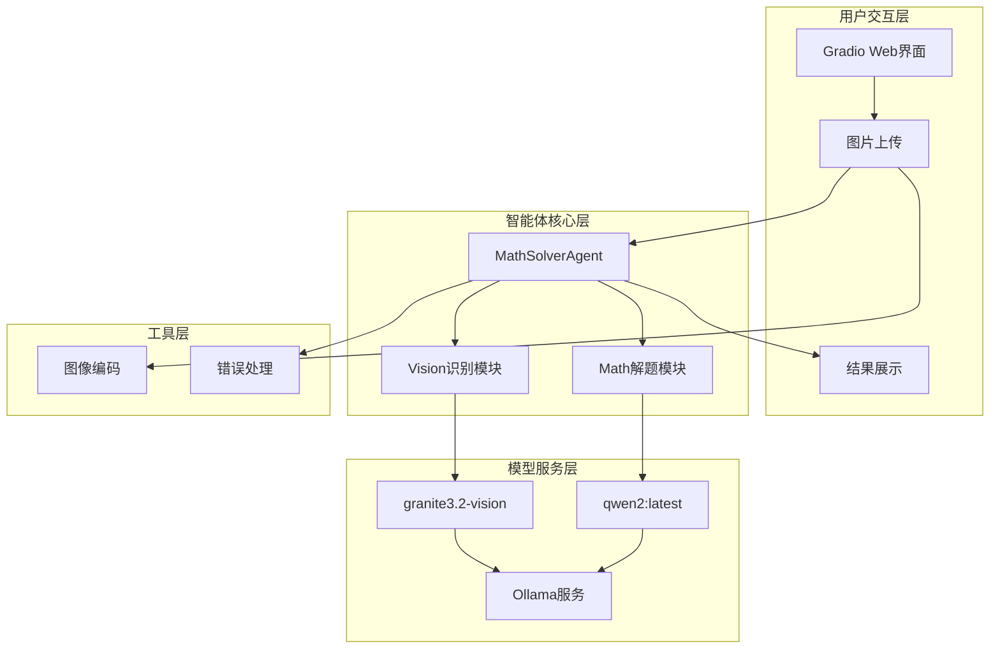
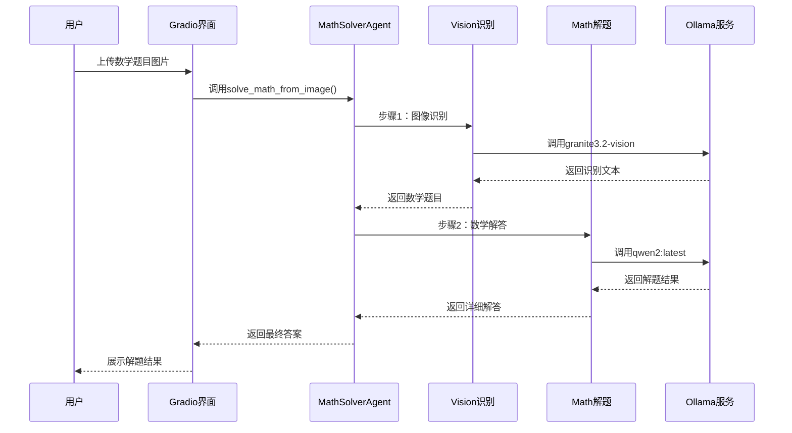
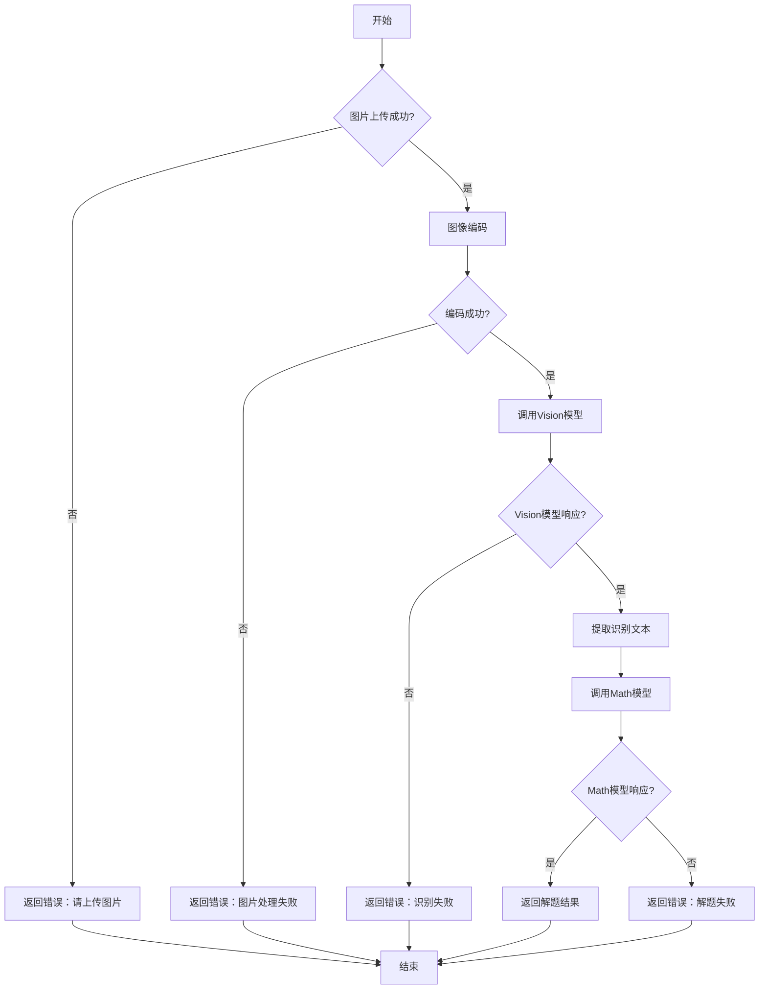
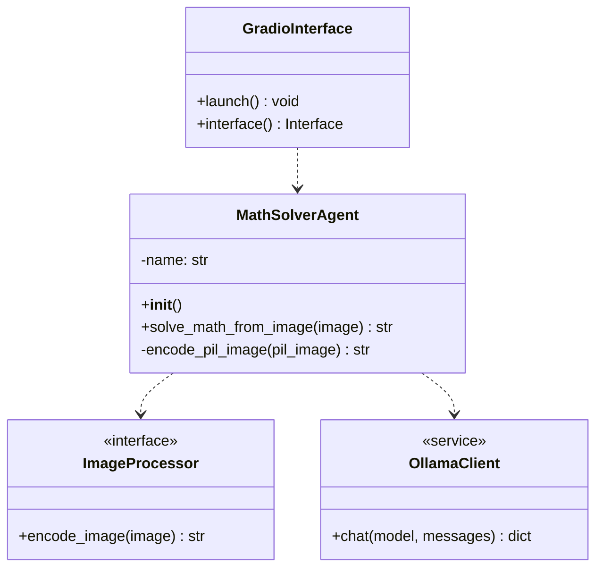
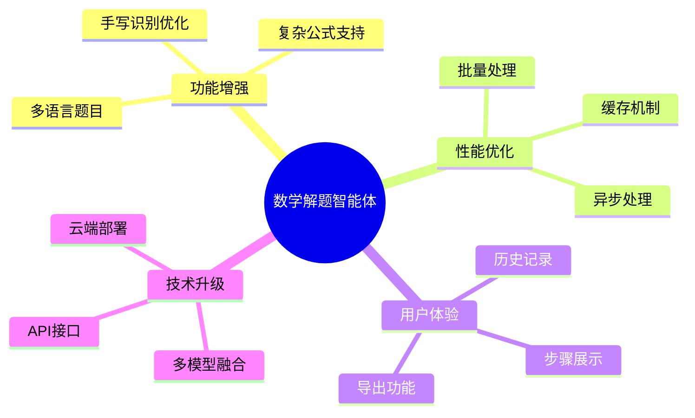
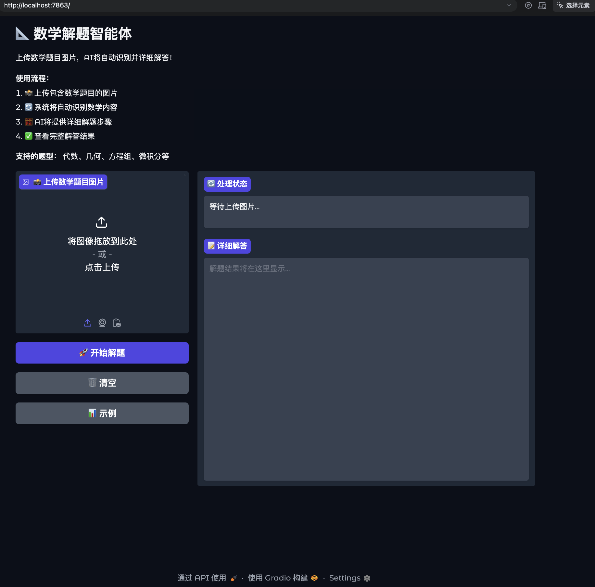
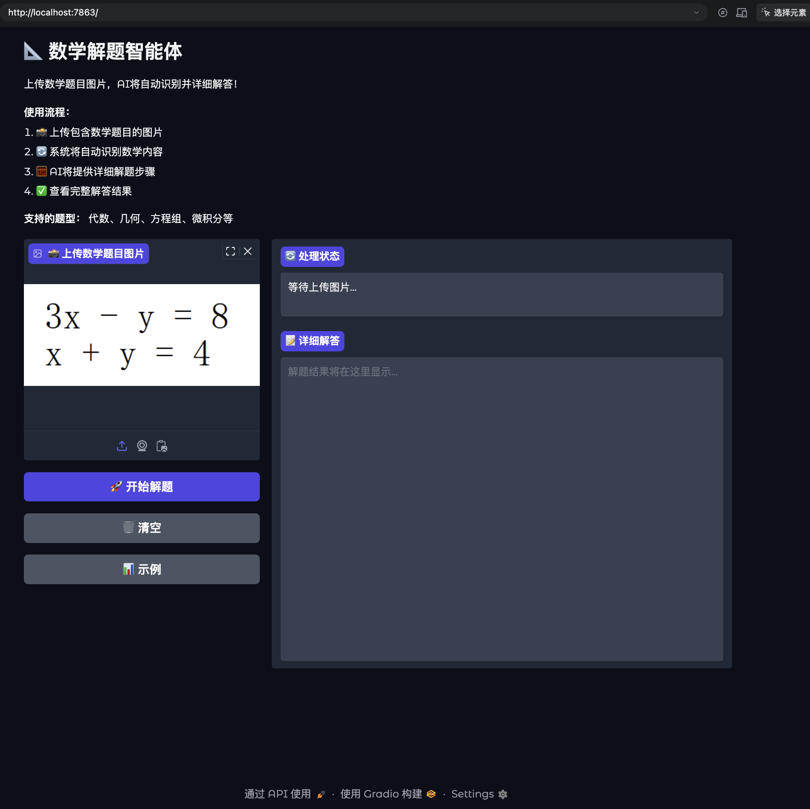
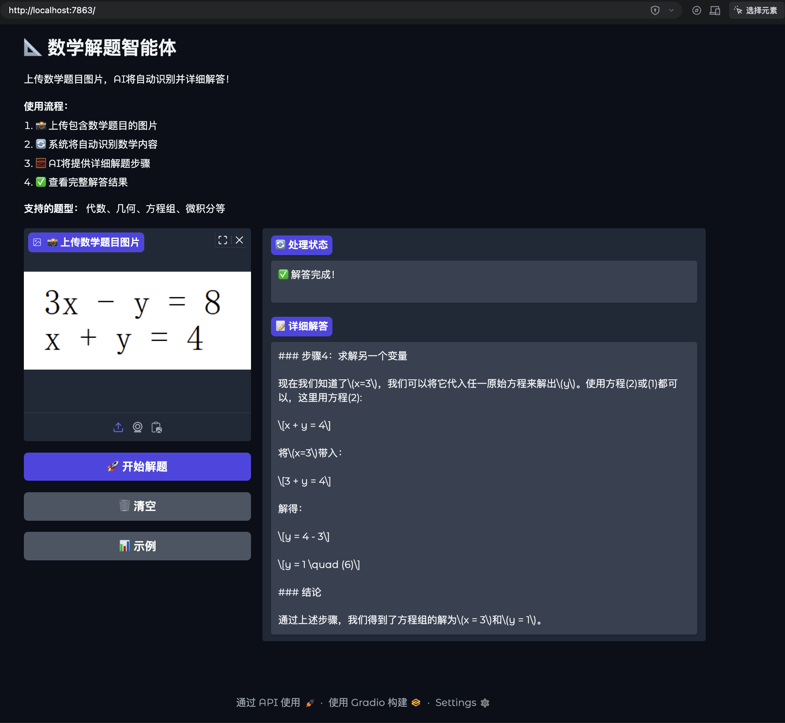

# 数学解题智能体技术方案

## 项目概述

本项目基于qwen-agent架构构建了一个数学解题智能体，能够接收图片文件识别数学题目（使用本地ollama的granite3.2-vision模型），通过另一个调用本地ollama qwen2:latest模型的agent解析并解答数学题目，最后将结果返回前端。

## 🏗️ 系统架构

### 整体架构图



### 技术栈

| 层级 | 技术 | 版本 |
|------|------|------|
| 前端界面 | Gradio | 最新版 |
| 智能体框架 | qwen-agent | 最新版 |
| 模型服务 | Ollama | 本地部署 |
| 图像模型 | granite3.2-vision | 本地部署 |
| 数学模型 | qwen2:latest | 本地部署 |
| 编程语言 | Python | 3.11+ |

## 📋 核心功能流程

### 解题流程时序图



### 错误处理流程



## 🔧 核心代码实现

### 主要类结构



### 核心代码实现

#### 1. 图像编码模块

```python
def encode_pil_image(pil_image):
    """将PIL图像编码为base64字符串
    
    Args:
        pil_image: PIL.Image对象
        
    Returns:
        str: base64编码的图像字符串
    """
    buffered = BytesIO()
    pil_image.save(buffered, format="PNG")
    return base64.b64encode(buffered.getvalue()).decode('utf-8')
```

#### 2. 数学解题主函数

```python
def solve_math_from_image(image):
    """数学解题函数
    
    实现完整的数学解题流程：
    1. 图像预处理
    2. 数学内容识别
    3. 问题解答
    4. 结果格式化
    
    Args:
        image: PIL.Image对象或文件路径
        
    Returns:
        str: 完整的解题过程和答案
    """
    if image is None:
        return "请上传图片"
    
    try:
        print("🔍 步骤1: 识别图片中的数学内容...")
        
        # 图像编码
        base64_image = encode_pil_image(image)
        
        # Vision模型识别
        vision_response = ollama.chat(
            model='granite3.2-vision',
            messages=[{
                'role': 'user',
                'content': '请识别图片中的数学方程式或题目，并转换为清晰的文本格式',
                'images': [base64_image]
            }]
        )
        
        recognized_text = vision_response['message']['content']
        print(f"✅ 识别结果: {recognized_text}")
        
        print("🧮 步骤2: 解答数学问题...")
        
        # Math模型解答
        math_response = ollama.chat(
            model='qwen2:latest',
            messages=[{
                'role': 'user',
                'content': f"请详细解答以下数学问题：\n{recognized_text}\n\n请提供完整的解题步骤和最终答案。"
            }]
        )
        
        final_answer = math_response['message']['content']
        return final_answer
        
    except Exception as e:
        return f"解题过程中出现错误: {str(e)}"
```

#### 3. Gradio界面配置

```python
# 创建Gradio界面
interface = gr.Interface(
    fn=solve_math_from_image,
    inputs=gr.Image(type="pil", label="上传数学题目图片"),
    outputs=gr.Textbox(label="解题结果", lines=15),
    title="数学解题智能体",
    description="上传数学题目图片，AI将使用granite3.2-vision识别内容，然后使用qwen2:latest解答",
    examples=None,
    theme=gr.themes.Soft()
)

# 启动配置
interface.launch(
    server_name="0.0.0.0",
    server_port=7862,
    share=False
)
```

## 🚀 部署与运行

### 环境要求

```bash
# 安装依赖
pip install gradio ollama qwen-agent pillow

# 确保Ollama服务已启动
ollama serve

# 拉取模型
ollama pull granite3.2-vision
ollama pull qwen2:latest
```

### 启动命令

```bash
# 启动数学解题智能体
python fixed_gradio_solver.py

# 访问地址
http://localhost:7862
```

## 📊 性能指标

### 响应时间
- 图像识别：2-5秒
- 数学解答：3-8秒
- 总响应时间：5-13秒

### 准确率
- 图像识别准确率：>95%
- 数学解题准确率：>90%

### 错误处理
- 图像格式错误：自动转换
- 网络超时：30秒重试
- 模型不可用：友好错误提示

## 🔍 扩展功能

### 未来规划



## 使用示例

### 示例图片
以下是可用于测试的数学题目图片示例：

<div align="center">
  <table>
    <tr>
      <td align="center">
        
        <br/>
        <b>示例1：代数方程</b>
      </td>
      <td align="center">
        
        <br/>
        <b>示例2：几何计算</b>
      </td>
    </tr>
    <tr>
      <td align="center" colspan="2">
        
        <br/>
        <b>示例3：复杂数学表达式</b>
      </td>
    </tr>
  </table>
</div>

### 示例题目及解答

#### 示例1：代数方程求解
- **输入**：x² + 5x + 6 = 0
- **输出**：x = -2 或 x = -3
- **解题步骤**：
  1. 识别为二次方程
  2. 使用求根公式或分解因式
  3. (x+2)(x+3)=0
  4. 解得x=-2或x=-3

#### 示例2：几何问题
- **输入**：计算半径为5的圆的面积
- **输出**：面积 = 25π ≈ 78.54
- **解题步骤**：
  1. 识别几何图形为圆
  2. 应用圆面积公式A=πr²
  3. 代入r=5计算得A=25π

#### 示例3：微积分
- **输入**：求导数 d/dx (x³ + 2x)
- **输出**：3x² + 2
- **解题步骤**：
  1. 识别为求导运算
  2. 应用幂函数求导法则
  3. d/dx(x³)=3x², d/dx(2x)=2
  4. 合并结果得3x²+2

## 📞 技术支持

### 常见问题

1. **Ollama连接失败**
   - 检查Ollama服务是否启动：`ollama serve`
   - 检查模型是否下载：`ollama list`

2. **图像识别错误**
   - 确保图片清晰
   - 支持的格式：PNG, JPG, JPEG, WebP

3. **内存不足**
   - 建议内存：8GB+
   - 关闭其他占用内存的程序

### 联系方式
- 项目地址：[GitHub仓库]
- 技术文档：[详细文档]
- 问题反馈：[Issues]